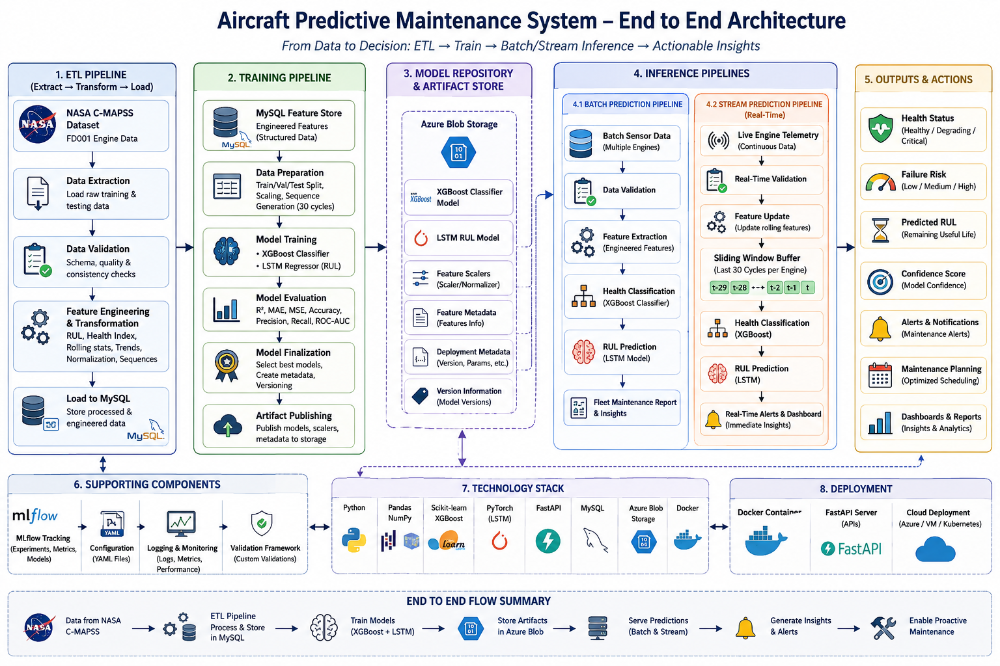

# Aircraft Predictive Maintenance System

> An end-to-end Machine Learning System that predicts Aircraft Engine Health Status and Remaining Useful Life (RUL) using a Hybrid XGBoost + LSTM architecture, enabling proactive maintenance planning and reducing unexpected engine failures.

---

## Project Overview

Aircraft engines generate large volumes of sensor measurements throughout their operational lifecycle. Unexpected failures can lead to costly maintenance, operational disruptions, and safety risks.

This project builds a **Production-Ready Predictive Maintenance System** that:

* Implements an ETL pipeline that extracts NASA C-MAPSS data, validates it, engineers degradation features, and stores processed datasets in MySQL
* Predicts Remaining Useful Life (RUL) of aircraft engines
* Classifies engine health status and failure risk
* Supports both Batch and Real-Time predictions
* Exposes predictions through FastAPI REST APIs
* Uses MLflow for experiment tracking and model versioning
* Stores production artifacts in Azure Blob Storage
* Supports future monitoring and automated retraining workflows

This project demonstrates the complete Machine Learning lifecycle including Data Engineering, Feature Engineering, Model Development, MLOps, Deployment, and Real-Time Inference.

---

## System Architecture

<p align="center">
  <br>
  <b><em>System Architecture & Inference of Aircraft Maintenance Pipeline</em></b>
</p>

### ETL Pipeline

The project begins with an ETL (Extract, Transform, Load) pipeline that prepares aircraft engine sensor data for downstream machine learning workflows.

### Workflow

```text
NASA C-MAPSS Dataset
        ↓
Data Extraction
        ↓
Data Validation
        ↓
Feature Engineering
        ↓
Data Transformation
        ↓
MySQL Data Warehouse
```

### Responsibilities

#### Extract

* Reads raw NASA C-MAPSS engine degradation datasets
* Loads training and testing engine trajectories
* Preserves engine lifecycle information
* Maintains engine-level sequence ordering

#### Transform

* Performs schema validation
* Validates data quality and consistency
* Generates Remaining Useful Life (RUL)
* Creates Health Index features
* Generates Failure Window labels
* Computes rolling statistical features
* Creates degradation trend indicators
* Normalizes sensor measurements
* Generates temporal sequence features

#### Load

* Stores transformed datasets in MySQL
* Provides centralized storage for ML workflows
* Enables reproducible feature retrieval
* Supports future monitoring and retraining workflows

---

### Training Pipeline

### Workflow

```text
MySQL Feature Store
        ↓
Data Transformation
        ↓
Model Training
        ↓
Model Evaluation
        ↓
Model Finalization
        ↓
Artifact Publishing
```

### Responsibilities

* Reads engineered features from MySQL
* Generates train-validation-test splits
* Creates temporal sequences for LSTM
* Trains classification and RUL prediction models
* Evaluates candidate models
* Selects production-ready models
* Publishes artifacts to Azure Blob Storage

---

### Batch Prediction Pipeline

The Batch Prediction Pipeline is designed for fleet-wide maintenance analysis where predictions are generated for multiple engines simultaneously.

### Workflow

```text
Batch Sensor Data
        ↓
Data Validation
        ↓
Feature Extraction
        ↓
Health Classification
        ↓
RUL Prediction
        ↓
Fleet Maintenance Report
```

### Use Cases

* Daily fleet health assessment
* Maintenance scheduling
* Aircraft availability planning
* Failure risk prioritization
* Maintenance resource allocation

### Processing Logic

For each engine:

1. Validate incoming sensor measurements
2. Generate engineered features
3. Retrieve latest engine state
4. Run XGBoost classifier
5. Generate LSTM sequence
6. Predict Remaining Useful Life
7. Aggregate results into fleet report

### Output Example

```json
[
  {
    "engine_id": 1,
    "predicted_rul": 87,
    "confidence" : 0.20,
    "health_status": "Healthy"
  },
  {
    "engine_id": 2,
    "predicted_rul": 14,
    "confidence" : 0.95,
    "health_status": "Critical"
  }
]
```

### Benefits

* High throughput processing
* Fleet-level visibility
* Maintenance prioritization
* Resource optimization
* Historical trend analysis

---

### Stream Prediction Pipeline

The Stream Prediction Pipeline is designed for real-time engine monitoring using continuously arriving telemetry data.

### Workflow

```text
Live Engine Telemetry
        ↓
Real-Time Validation
        ↓
Feature Update
        ↓
Sliding Window Generation
        ↓
Health Classification
        ↓
RUL Prediction
        ↓
Real-Time Alerting
```

### Use Cases

* Live engine monitoring
* In-flight engine health assessment
* Early anomaly detection
* Real-time maintenance alerts
* Continuous health tracking

### Processing Logic

For each incoming telemetry record:

1. Receive sensor measurements
2. Validate incoming data
3. Update engine history buffer
4. Recompute required features
5. Maintain rolling sequence window
6. Run classification model
7. Run LSTM prediction model
8. Return prediction instantly

### Sliding Window Approach

The system maintains the latest 30 operational cycles for each engine.

```text
Cycle 1 ... Cycle 30
        ↓
Predict

New Cycle Arrives

Cycle 2 ... Cycle 31
        ↓
Predict
```

This allows the LSTM to continuously evaluate the latest degradation trajectory.

### Real-Time Outputs

* Current Health Status
* Failure Risk
* Predicted RUL
* Alert Severity
* Prediction Confidence

### Benefits

* Continuous monitoring
* Early failure detection
* Immediate maintenance alerts
* Reduced unplanned downtime
* Improved operational safety

---

### Inference Pipeline

### Workflow

```text
Input Sensor Data
        ↓
Feature Extraction
        ↓
Health Classification
        ↓
RUL Prediction
        ↓
Prediction Response
```

### Outputs

* Engine Health Status
* Failure Risk Category
* Remaining Useful Life (RUL)
* Confidence Scores
* Engine-Level Predictions

---

## Dataset

The system is trained using the NASA C-MAPSS FD001 Aircraft Engine Degradation Dataset.

| Property             | Details            |
| -------------------- | ------------------ |
| Dataset              | NASA C-MAPSS FD001 |
| Training Engines     | 100                |
| Testing Engines      | 100                |
| Training Records     | 20,631             |
| Testing Records      | 13,096             |
| Operating Conditions | Single             |
| Fault Type           | HPC Degradation    |
| Sensor Measurements  | 21                 |
| Operational Settings | 3                  |

---

## Feature Engineering

The feature engineering pipeline transforms raw sensor readings into degradation-aware features.

### Feature Categories

| Category             | Features                       |
| -------------------- | ------------------------------ |
| Operational Features | Operational settings           |
| Sensor Features      | Normalized sensor readings     |
| Statistical Features | Mean, Std, Min, Max            |
| Trend Features       | Rolling degradation statistics |
| Health Features      | Health Index                   |
| Temporal Features    | Sequence windows               |
| Failure Features     | Failure labels                 |
| Target Features      | RUL, Capped RUL                |

### Generated Outputs

* Health Index
* Failure Window Labels
* Failure Risk Categories
* Capped RUL Targets
* Temporal Sequences
* Normalized Sensor Features
* Rolling Statistics

---

## Key EDA Findings

### Dataset Quality

* No missing values detected
* No duplicate records
* All variables are numerical
* Sensor data is structurally clean

### Impact

No imputation was required, allowing focus on feature engineering and degradation modeling.

---

### Remaining Useful Life Analysis

RUL was generated as:

```text
RUL = Maximum Engine Cycle − Current Cycle
```

### RUL Statistics

| Metric             | Value  |
| ------------------ | ------ |
| Mean               | 107.81 |
| Median             | 103    |
| Standard Deviation | 68.88  |
| Maximum            | 361    |

### Key Findings

* RUL distribution is positively skewed
* Most observations occur below 200 cycles
* Near-failure samples dominate the dataset
* Degradation behavior becomes increasingly important as engines approach failure

---

### Engine Lifecycle Analysis

| Metric           | Value      |
| ---------------- | ---------- |
| Average Lifespan | 206 Cycles |
| Minimum Lifespan | 128 Cycles |
| Maximum Lifespan | 362 Cycles |

### Findings

* Large variability exists across engines
* Some engines degrade rapidly
* Others remain healthy for extended periods
* Models must generalize across multiple degradation trajectories

---

### Degradation Behavior

EDA revealed:

* Engine degradation is temporal
* Failure progression accelerates near end-of-life
* Historical sensor behavior contains valuable predictive information
* Static models cannot fully capture degradation patterns

These findings motivated:

* Sequence generation
* Health Index creation
* Temporal feature engineering
* LSTM-based RUL prediction

---

## Model Training & Results

### Data Preparation

* Sensor features normalized
* Cycle count Min-Max scaled
* Standardized RUL targets
* RUL capped at 125 cycles
* Approximately 75 engineered features generated

---

### Regression Model Comparison

| Model         | R² Score  | MAE (Cycles) | MSE        |
| ------------- | --------- | ------------ | ---------- |
| Random Forest | 0.887     | 10.05        | 181.78     |
| XGBoost       | 0.870     | 10.63        | 208.25     |
| **LSTM**      | **0.900** | **9.40**     | **160.71** |

### Why LSTM Outperformed?

Unlike tree-based models, the LSTM:

* Learns degradation trajectories
* Captures temporal dependencies
* Models failure acceleration
* Uses historical context

As a result, it achieved the highest R² score and lowest prediction error among all evaluated regression models.

---

### Failure Classification Model

### XGBoost Classification Results

| Metric    | Score |
| --------- | ----- |
| Accuracy  | 97.6% |
| Precision | 92.6% |
| Recall    | 91.5% |
| ROC-AUC   | 0.996 |

---

## Final Production Architecture

### XGBoost Classification Model

Predicts:

* Healthy
* Degrading
* Critical
* Failure within 30 cycles

### LSTM RUL Model

Predicts:

* Remaining Useful Life
* Degradation trajectory
* Maintenance horizon

### Why Hybrid?

The classifier provides fast failure-risk assessment while the LSTM delivers accurate Remaining Useful Life estimation.

Together they provide:

* Early warning capability
* Accurate maintenance scheduling
* Reduced unexpected failures
* Improved operational planning

---

## Model Finalization

The Model Finalizer:

* Evaluates candidate models
* Computes weighted evaluation scores
* Selects production models
* Creates deployment metadata
* Generates versioned artifacts

### Produced Artifacts

* XGBoost Classifier
* LSTM RUL Model
* Feature Scalers
* Feature Metadata
* Deployment Metadata
* Version Information

---

## Artifact Publishing

Selected artifacts are automatically published to Azure Blob Storage.

### Published Components

* Trained Models
* Scalers
* Metadata Files
* Feature Definitions
* Version Information

---

## Deployment

The trained models are deployed through FastAPI and Azure Blob Storage.

## Backend APIs

### Batch Prediction API

Provides fleet-level predictions for multiple engines simultaneously.

### Stream Prediction API

Provides real-time predictions for continuously arriving telemetry.

### Example Response

```json
{
  "engine_id": 101,
  "predicted_rul": 43,
  "confidence": 0.94,
  "health_status": "Degrading"
}
```

---

## Technology Stack

| Category         | Tools                       |
| ---------------- | --------------------------- |
| Language         | Python                      |
| Data Processing  | Pandas, NumPy               |
| Database         | MySQL                       |
| Machine Learning | Scikit-Learn, XGBoost       |
| Deep Learning    | PyTorch                     |
| API Framework    | FastAPI                     |
| Model Tracking   | MLflow                      |
| Cloud Storage    | Azure Blob Storage          |
| Configuration    | YAML                        |
| Containerization | Docker                      |
| Deployment       | Container Apps & Virtual Machine (for MLflow Server)|

---

## Repository Structure

```text
aircraft-predictive-maintenance/
│
├── notebooks/
│
├── predictivesystem/
│   ├── components/
│   ├── entity/
│   ├── pipeline/
│   ├── database/
│   ├── utils/
│   ├── exception/
│   └── logging/
│
├── backend/
│   ├── routers/
│   ├── services/
│   ├── schemas/
│   ├── utils/
│   ├── app.py
│   ├── startup.py
│   ├── config.py
│   └── .env
│
├── mlruns/
├── configs/
├── requirements.txt
└── README.md
```
---

## Results Summary

* 20,631 training observations
* 13,096 testing observations
* 75 engineered degradation features
* Average engine lifespan of 206 cycles
* Random Forest R² = 0.887
* XGBoost R² = 0.870
* LSTM R² = 0.900
* Classification Accuracy = 97.6%
* ROC-AUC = 0.996
* Hybrid XGBoost + LSTM Production Architecture
* Batch Prediction Support
* Real-Time Stream Prediction Support
* Azure Blob Artifact Management
* FastAPI Deployment

---